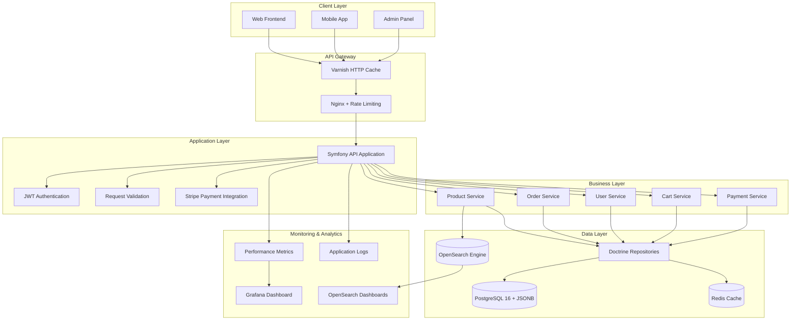
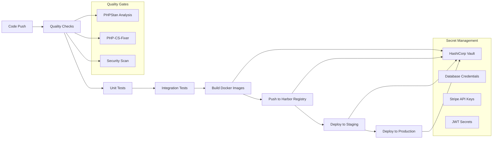

# Design Document

## Overview

The Symfony Headless E-commerce Platform is designed as a modern, API-first e-commerce solution that demonstrates the evolution from functional but unoptimized code to enterprise-grade performance. The system uses Symfony 6.4 LTS with Doctrine ORM, following Domain-Driven Design principles and repository patterns to create a maintainable, extensible foundation.

The architecture intentionally starts with common performance anti-patterns (N+1 queries, missing indexes, inefficient serialization) that will be systematically optimized and documented through a detailed blog series, showcasing senior-level optimization expertise.

## Architecture

### High-Level Architecture



### Technology Stack

#### Phase 1: Traditional Stack (Unoptimized)
- **Web Server:** Nginx 1.24
- **PHP Runtime:** PHP-FPM 8.4
- **Framework:** Symfony 6.4 LTS
- **ORM:** Doctrine ORM 2.17
- **Database:** PostgreSQL 16 (superior ACID compliance and JSON support)
- **Cache:** Redis 7.0 (minimal usage)
- **Payment Gateway:** Stripe API v2023-10-16
- **Authentication:** LexikJWTAuthenticationBundle
- **API Documentation:** NelmioApiDocBundle (OpenAPI/Swagger)
- **Serialization:** Symfony Serializer Component
- **Validation:** Symfony Validator Component
- **Testing:** PHPUnit + Doctrine Test Bundle
- **Performance Monitoring:** Custom metrics endpoints
- **Containerization:** Docker with Docker Compose

#### Phase 2+: Optimized Stack Evolution
- **Web Server:** FrankenPHP 1.0+ (Worker Mode)
- **HTTP Cache:** Varnish 7.0 (Phase 4)
- **PHP Runtime:** Embedded PHP 8.4 with persistent memory
- **Framework:** Symfony 6.4 LTS (optimized for worker mode)
- **ORM:** Doctrine ORM 2.17 (with connection pooling)
- **Database:** PostgreSQL 16 (with read replicas and advanced indexing)
- **Cache:** Redis 7.0 (advanced caching strategies)
- **Search Engine:** OpenSearch 2.0+ (Phase 5+)
- **Load Testing:** Artillery.io for performance comparisons
- **Monitoring:** Grafana + Prometheus for real-time metrics
- **Search Analytics:** OpenSearch Dashboards (read-only public access)

## Components and Interfaces

### API Layer Components

#### 1. Product API Controller
```php
// Intentionally unoptimized for demonstration
class ProductController extends AbstractController
{
    #[Route('/api/products', methods: ['GET'])]
    public function list(ProductRepository $repository): JsonResponse
    {
        // Will demonstrate N+1 query problem
        $products = $repository->findAll();
        return $this->json($products);
    }
    
    #[Route('/api/products/{id}', methods: ['GET'])]
    public function show(int $id, ProductRepository $repository): JsonResponse
    {
        // Will demonstrate inefficient single queries
        $product = $repository->find($id);
        return $this->json($product);
    }
}
```

#### 2. Order Management Controller
```php
class OrderController extends AbstractController
{
    #[Route('/api/orders', methods: ['POST'])]
    public function create(Request $request, OrderService $orderService): JsonResponse
    {
        // Will demonstrate transaction handling and validation
        $orderData = json_decode($request->getContent(), true);
        $order = $orderService->createOrder($orderData);
        
        return $this->json([
            'order' => $order,
            'payment_client_secret' => $order->getPayment()->getStripePaymentIntentId()
        ], 201);
    }
}
```

#### 3. Payment Controller (Stripe Integration)
```php
class PaymentController extends AbstractController
{
    #[Route('/api/payments/webhook', methods: ['POST'])]
    public function stripeWebhook(Request $request, PaymentService $paymentService): JsonResponse
    {
        // Handle Stripe webhooks for payment confirmations
        $payload = $request->getContent();
        $signature = $request->headers->get('stripe-signature');
        
        // Verify webhook signature and process payment
        $event = $this->verifyStripeWebhook($payload, $signature);
        
        if ($event->type === 'payment_intent.succeeded') {
            $paymentService->confirmPayment($event->data->object->id);
        }
        
        return $this->json(['status' => 'success']);
    }
    
    #[Route('/api/payments/{id}/status', methods: ['GET'])]
    public function getPaymentStatus(int $id, PaymentRepository $repository): JsonResponse
    {
        $payment = $repository->find($id);
        return $this->json(['status' => $payment->getStatus()]);
    }
}
```

### Business Logic Layer

#### 1. Product Service
```php
class ProductService
{
    public function __construct(
        private ProductRepository $productRepository,
        private CategoryRepository $categoryRepository
    ) {}
    
    public function searchProducts(array $criteria): array
    {
        // Initial implementation will be inefficient
        // Later optimized with proper indexing and caching
        return $this->productRepository->findByCriteria($criteria);
    }
}
```

#### 2. Order Service
```php
class OrderService
{
    public function __construct(
        private PaymentService $paymentService,
        private OrderRepository $orderRepository
    ) {}
    
    public function createOrder(array $orderData): Order
    {
        // Will demonstrate business logic separation
        // and transaction management
        $order = new Order();
        // ... order creation logic
        
        // Create payment intent with Stripe
        $payment = $this->paymentService->createPaymentIntent($order);
        $order->setPayment($payment);
        
        return $order;
    }
}
```

#### 3. Payment Service (Stripe Integration)
```php
class PaymentService
{
    public function __construct(
        private StripeClient $stripeClient,
        private PaymentRepository $paymentRepository
    ) {}
    
    public function createPaymentIntent(Order $order): Payment
    {
        // Create Stripe Payment Intent
        $paymentIntent = $this->stripeClient->paymentIntents->create([
            'amount' => (int)($order->getTotal() * 100), // Convert to cents
            'currency' => 'usd',
            'metadata' => [
                'order_id' => $order->getId()
            ]
        ]);
        
        // Create local payment record
        $payment = new Payment();
        $payment->setOrder($order);
        $payment->setStripePaymentIntentId($paymentIntent->id);
        $payment->setAmount($order->getTotal());
        $payment->setCurrency('usd');
        $payment->setStatus('pending');
        
        return $payment;
    }
    
    public function confirmPayment(string $paymentIntentId): Payment
    {
        // Handle Stripe webhook or confirmation
        $payment = $this->paymentRepository->findByStripePaymentIntentId($paymentIntentId);
        
        // Update payment status based on Stripe response
        $payment->setStatus('succeeded');
        $payment->setPaidAt(new \DateTime());
        
        return $payment;
    }
}
```

### Repository Layer (Doctrine)

#### 1. Product Repository
```php
class ProductRepository extends ServiceEntityRepository
{
    public function findByCriteria(array $criteria): array
    {
        $qb = $this->createQueryBuilder('p');
        
        // Initial version will have performance issues
        if (isset($criteria['category'])) {
            $qb->join('p.category', 'c')
               ->andWhere('c.name = :category')
               ->setParameter('category', $criteria['category']);
        }
        
        return $qb->getQuery()->getResult();
    }
    
    public function findWithRelations(int $id): ?Product
    {
        // Will demonstrate eager vs lazy loading issues
        return $this->createQueryBuilder('p')
            ->leftJoin('p.category', 'c')
            ->leftJoin('p.reviews', 'r')
            ->where('p.id = :id')
            ->setParameter('id', $id)
            ->getQuery()
            ->getOneOrNullResult();
    }
}
```

## Data Models

### Core Entities

#### Product Entity (Leveraging PostgreSQL JSON Support)
```php
#[ORM\Entity(repositoryClass: ProductRepository::class)]
#[ORM\Table(name: 'products')]
class Product
{
    #[ORM\Id]
    #[ORM\GeneratedValue]
    #[ORM\Column]
    private ?int $id = null;
    
    #[ORM\Column(length: 255)]
    private ?string $name = null;
    
    #[ORM\Column(type: Types::TEXT)]
    private ?string $description = null;
    
    #[ORM\Column(type: Types::DECIMAL, precision: 10, scale: 2)]
    private ?string $price = null;
    
    #[ORM\Column]
    private ?int $stock = null;
    
    #[ORM\ManyToOne(targetEntity: Category::class)]
    #[ORM\JoinColumn(nullable: false)]
    private ?Category $category = null;
    
    #[ORM\OneToMany(mappedBy: 'product', targetEntity: Review::class)]
    private Collection $reviews;
    
    // PostgreSQL JSON column for flexible product attributes
    #[ORM\Column(type: Types::JSON, nullable: true)]
    private ?array $attributes = null; // size, color, material, etc.
    
    // PostgreSQL JSON column for variant data
    #[ORM\Column(type: Types::JSON, nullable: true)]
    private ?array $variants = null; // different sizes/colors with their own prices/stock
    
    // PostgreSQL JSON column for SEO and metadata
    #[ORM\Column(type: Types::JSON, nullable: true)]
    private ?array $metadata = null; // SEO tags, custom fields, etc.
    
    // Getters and setters..
```

#### Order Entity
```php
#[ORM\Entity(repositoryClass: OrderRepository::class)]
#[ORM\Table(name: 'orders')]
class Order
{
    #[ORM\Id]
    #[ORM\GeneratedValue]
    #[ORM\Column]
    private ?int $id = null;
    
    #[ORM\ManyToOne(targetEntity: User::class)]
    #[ORM\JoinColumn(nullable: false)]
    private ?User $customer = null;
    
    #[ORM\Column(type: Types::DECIMAL, precision: 10, scale: 2)]
    private ?string $total = null;
    
    #[ORM\Column(length: 50)]
    private ?string $status = null;
    
    #[ORM\OneToMany(mappedBy: 'order', targetEntity: OrderItem::class, cascade: ['persist'])]
    private Collection $items;
    
    #[ORM\OneToOne(mappedBy: 'order', targetEntity: Payment::class, cascade: ['persist'])]
    private ?Payment $payment = null;
    
    #[ORM\Column(type: Types::DATETIME_MUTABLE)]
    private ?\DateTimeInterface $createdAt = null;
    
    // Getters and setters...
}
```

#### Payment Entity
```php
#[ORM\Entity(repositoryClass: PaymentRepository::class)]
#[ORM\Table(name: 'payments')]
class Payment
{
    #[ORM\Id]
    #[ORM\GeneratedValue]
    #[ORM\Column]
    private ?int $id = null;
    
    #[ORM\OneToOne(targetEntity: Order::class)]
    #[ORM\JoinColumn(nullable: false)]
    private ?Order $order = null;
    
    #[ORM\Column(length: 255)]
    private ?string $stripePaymentIntentId = null;
    
    #[ORM\Column(type: Types::DECIMAL, precision: 10, scale: 2)]
    private ?string $amount = null;
    
    #[ORM\Column(length: 3)]
    private ?string $currency = null;
    
    #[ORM\Column(length: 50)]
    private ?string $status = null; // pending, succeeded, failed, canceled
    
    #[ORM\Column(type: Types::JSON, nullable: true)]
    private ?array $stripeMetadata = null;
    
    #[ORM\Column(type: Types::DATETIME_MUTABLE)]
    private ?\DateTimeInterface $createdAt = null;
    
    #[ORM\Column(type: Types::DATETIME_MUTABLE, nullable: true)]
    private ?\DateTimeInterface $paidAt = null;
    
    // Getters and setters...
}
```

### Database Design: Why PostgreSQL Over MySQL

#### Strategic Database Choice: PostgreSQL 16

**Superior ACID Compliance:**
- True MVCC (Multi-Version Concurrency Control) for better concurrent performance
- Stronger consistency guarantees for financialartitioned is
- Better deadlock detection and resolution

**Advanced JSON Support:**
- Native JSONB data type with indexing support
- GIN indexes on JSON fields for fast queries
- JSON path queries and operators
- Perfect for flexible product attributes and variants

**Performance Advantages:**
- Better query planner and optimizer
- Partial indexes for conditional performance
- Advanced indexing types (GIN, GiST, BRIN)
- Table partitioning for large datasets

**E-commerce Specific Benefits:**
```sql
-- PostgreSQL JSON queries for product search
SELECT * FROM products 
WHERE attributes->>'color' = 'red' 
  AND (attributes->>'size')::text[] && ARRAY['M', 'L'];

-- Efficient variant pricing queries
SELECT id, name, 
       jsonb_path_query_array(variants, '$[*].price') as variant_prices
FROM products 
WHERE variants @> '[{"available": true}]';

-- Advanced search with full-text search
SELECT * FROM products 
WHERE to_tsvector('english', name || ' ' || description) 
      @@ plainto_tsquery('wireless headphones');
```

#### Initial Database Design (Intentional Performance Issues)

The initial database design will intentionally lack optimizations to demonstrate improvement:

1. **Missing Indexes:** Product search fields won't have proper indexes initially
2. **No JSON Indexing:** JSONB fields won't have GIN indexes initially  
3. **Inefficient Relationships:** Some foreign keys will lack proper indexing
4. **No Partitioning:** Large tables won't be partitioned initially
5. **Basic

## Error Handling

### Exception Hierarchy
```php
// Custom exception hierarchy for business logic
abstract class EcommerceException extends Exception {}

class ProductNotFoundException extends EcommerceException {}
class InsufficientStockException extends EcommerceException {}
class InvalidOrderDataException extends EcommerceException {}
class PaymentProcessingException extends EcommerceException {}
```

### Global Exception Handler
```php
class ApiExceptionListener
{
    public function onKernelException(ExceptionEvent $event): void
    {
        $exception = $event->getThrowable();
        
        $response = match (true) {
            $exception instanceof ProductNotFoundException => 
                new JsonResponse(['error' => 'Product not found'], 404),
            $exception instanceof ValidationException => 
                new JsonResponse(['error' => 'Validation failed', 'details' => $exception->getViolations()], 400),
            default => 
                new JsonResponse(['error' => 'Internal server error'], 500)
        };
        
        $event->setResponse($response);
    }
}
```

## Testing Strategy

### Test Pyramid Structure

#### 1. Unit Tests (70%)
- **Entity Tests:** Validate business logic in entities
- **Service Tests:** Test business logic in isolation
- **Repository Tests:** Test custom query methods
- **Validator Tests:** Test custom validation rules

#### 2. Integration Tests (20%)
- **API Endpoint Tests:** Test complete request/response cycles
- **Database Integration:** Test repository interactions with real database
- **Service Integration:** Test service layer with dependencies

#### 3. End-to-End Tests (10%)
- **Complete User Journeys:** Browse → Add to Cart → Checkout
- **Admin Workflows:** Product Management → Order Processing
- **Performance Tests:** Load testing for optimization comparison

### Testing Tools and Configuration

```yaml
# phpunit.xml.dist
<?xml version="1.0" encoding="UTF-8"?>
<phpunit xmlns:xsi="http://www.w3.org/2001/XMLSchema-instance"
         xsi:noNamespaceSchemaLocation="vendor/phpunit/phpunit/phpunit.xsd"
         bootstrap="tests/bootstrap.php"
         colors="true">
    <testsuites>
        <testsuite name="Unit">
            <directory>tests/Unit</directory>
        </testsuite>
        <testsuite name="Integration">
            <directory>tests/Integration</directory>
        </testsuite>
        <testsuite name="Functional">
            <directory>tests/Functional</directory>
        </testsuite>
    </testsuites>
</phpunit>
```

### Performance Testing Strategy

The system will include built-in performance monitoring to demonstrate optimization:

```php
class PerformanceMiddleware
{
    public function process(Request $request, RequestHandler $handler): Response
    {
        $startTime = microtime(true);
        $startMemory = memory_get_usage();
        
        $response = $handler->handle($request);
        
        $executionTime = microtime(true) - $startTime;
        $memoryUsage = memory_get_usage() - $startMemory;
        
        // Log metrics for comparison
        $this->metricsLogger->log([
            'endpoint' => $request->getPathInfo(),
            'execution_time' => $executionTime,
            'memory_usage' => $memoryUsage,
            'query_count' => $this->queryCounter->getCount()
        ]);
        
        return $response;
    }
}
```

## Performance Optimization Roadmap

### Phase 1: Traditional Infrastructure (Intentional Bottlenecks)
**Infrastructure:** Nginx + PHP-FPM + PostgreSQL
- N+1 query problems in product listings
- Missing database indexes
- Inefficient serialization
- No caching layer
- Process-per-request overhead (PHP-FPM)
- Cold start penalties for each request
- Memory allocation/deallocation per request

**Expected Performance:**
- Response Time: 800ms - 2000ms
- Memory Usage: 32MB per request
- Concurrent Users: 50-100 users
- Requests/Second: 50-100 RPS

### Phase 2: Infrastructure Optimization (FrankenPHP Worker Mode)
**Infrastructure:** FrankenPHP Worker Mode + PostgreSQL + Redis
- Same application code, different runtime
- Persistent PHP processes (no cold starts)
- Shared memory between requests
- Reduced garbage collection overhead
- Connection pooling benefits

**Expected Performance Improvement:**
- Response Time: 200ms - 500ms (60-75% improvement)
- Memory Usage: 8MB per request (75% reduction)
- Concurrent Users: 200-500 users (4-5x improvement)
- Requests/Second: 300-800 RPS (6-8x improvement)

### Phase 3: Code + Infrastructure Optimization
**Combined Optimizations:**
- FrankenPHP Worker Mode (infrastructure)
- Database indexes and query optimization (code)
- Redis caching implementation (code)
- Optimized Doctrine queries with proper joins (code)
- Custom serialization normalizers (code)

**Expected Performance:**
- Response Time: 50ms - 150ms (90%+ improvement from Phase 1)
- Memory Usage: 4MB per request (87% reduction)
- Concurrent Users: 1000+ users (10x+ improvement)
- Requests/Second: 2000+ RPS (20x+ improvement)

### Phase 4: HTTP Caching Layer (Varnish)
**Infrastructure:** FrankenPHP + Varnish + Redis + PostgreSQL
- HTTP-level caching with Varnish
- Cache invalidation strategies
- ESI (Edge Side Includes) for dynamic content
- Cache warming for popular products
- Proper cache headers and TTL management

**Expected Performance:**
- Response Time: 10ms - 50ms (95%+ improvement from Phase 1)
- Memory Usage: 2MB per request (93% reduction)
- Concurrent Users: 5000+ users (50x+ improvement)
- Requests/Second: 5000+ RPS (50x+ improvement)
- Cache Hit Ratio: 85-95% for product pages

### Phase 5: Search Optimization (OpenSearch)
**Infrastructure:** FrankenPHP + Varnish + Redis + PostgreSQL + OpenSearch
- Elasticsearch-compatible search with OpenSearch
- Fuzzy search and typo tolerance
- Natural Language Processing for search queries
- Search analytics and query optimization
- Auto-complete and search suggestions

**Search Features:**
- Product search with fuzzy matching
- Category and filter aggregations
- Search analytics dashboard (read-only public access)
- NLP-powered query understanding
- Search performance metrics

**Expected Performance for Search:**
- Search Response Time: 5ms - 20ms
- Fuzzy Search Accuracy: 95%+ with typos
- Search Throughput: 10,000+ queries/second
- Auto-complete Latency: <10ms

### Phase 6: Search-Driven Architecture
**Advanced Implementation:**
- Product listing pages served entirely by OpenSearch
- Real-time inventory sync to search index
- Search-first architecture for catalog browsing
- Advanced filtering and faceted search
- Personalized search results

**Expected Performance:**
- Listing Page Response: 5ms - 15ms (99% improvement)
- Complex Filter Queries: <50ms
- Concurrent Search Users: 10,000+
- Index Update Latency: <100ms

### Phase 7: Enterprise-Grade Performance
- Database read replicas
- Advanced caching strategies (cache warming, invalidation)
- CDN integration for static assets (Fastly/CloudFlare documentation)
- Horizontal scaling with load balancers
- Database connection pooling optimization
- Multi-region OpenSearch clusters

## Infrastructure Performance Demonstration

### Load Testing Strategy

The project will include comprehensive load testing to demonstrate the impact of infrastructure choices:

#### Load Testing Environment Configuration
```php
// config/packages/rate_limiter.yaml
framework:
    rate_limiter:
        api_requests:
            policy: 'sliding_window'
            limit: 1000
            interval: '1 minute'
            # Disable rate limiting in test environment
            enabled: '%env(bool:RATE_LIMITING_ENABLED)%'

# .env.test
RATE_LIMITING_ENABLED=false

# .env.prod  
RATE_LIMITING_ENABLED=true
```

#### Performance Testing Isolation
- Dedicated load testing environment without rate limits
- Separate database instance for consistent baseline
- Isolated Redis instance to prevent cache pollution
- Clean state reset between test runs

```yaml
# artillery-traditional.yml (Nginx + PHP-FPM)
config:
  target: 'http://traditional.ecommerce.local'
  phases:
    - duration: 60
      arrivalRate: 10
      name: "Warm up"
    - duration: 300
      arrivalRate: 50
      name: "Sustained load"
    - duration: 120
      arrivalRate: 100
      name: "Peak load"

scenarios:
  - name: "Product browsing"
    weight: 70
    flow:
      - get:
          url: "/api/products"
      - get:
          url: "/api/products/{{ $randomInt(1, 1000) }}"
  
  - name: "Order creation"
    weight: 30
    flow:
      - post:
          url: "/api/orders"
          json:
            items: [{ product_id: "{{ $randomInt(1, 100) }}", quantity: 2 }]
```

```yaml
# artillery-frankenphp.yml (FrankenPHP Worker Mode)
config:
  target: 'http://frankenphp.ecommerce.local'
  phases:
    - duration: 60
      arrivalRate: 50
      name: "Warm up"
    - duration: 300
      arrivalRate: 200
      name: "Sustained load"
    - duration: 120
      arrivalRate: 500
      name: "Peak load"
# Same scenarios, higher load capacity
```

### Performance Monitoring Dashboard

```php
class InfrastructureMetricsCollector
{
    public function collectMetrics(): array
    {
        return [
            'runtime' => [
                'type' => $this->detectRuntime(), // 'php-fpm' or 'frankenphp-worker'
                'memory_usage' => memory_get_usage(true),
                'peak_memory' => memory_get_peak_usage(true),
                'process_id' => getmypid(),
                'uptime' => $this->getProcessUptime()
            ],
            'performance' => [
                'response_time' => $this->responseTime,
                'database_queries' => $this->queryCount,
                'cache_hits' => $this->cacheHits,
                'cache_misses' => $this->cacheMisses
            ],
            'infrastructure' => [
                'concurrent_connections' => $this->getActiveConnections(),
                'worker_processes' => $this->getWorkerCount(),
                'connection_pool_size' => $this->getPoolSize()
            ]
        ];
    }
    
    private function detectRuntime(): string
    {
        return isset($_SERVER['FRANKENPHP_VERSION']) ? 'frankenphp-worker' : 'php-fpm';
    }
}
```

### Blog Content Strategy

The performance journey will be documented through detailed blog posts:

1. **"Why I Chose Symfony Over Laravel: The Doctrine Advantage"**
   - Repository pattern vs Active Record
   - Performance implications of different ORM approaches
   - Code maintainability and testability

2. **"The Hidden Cost of PHP-FPM: Why Your API is Slower Than It Should Be"**
   - Process lifecycle overhead analysis
   - Memory allocation patterns
   - Cold start penalties in traditional PHP

3. **"FrankenPHP Worker Mode: 10x Performance Without Changing Code"**
   - Infrastructure-level optimization
   - Persistent memory benefits
   - Connection pooling advantages
   - Real load test comparisons

4. **"HTTP Caching with Varnish: When Application Caching Isn't Enough"**
   - HTTP vs application-level caching
   - Varnish configuration for e-commerce
   - Cache invalidation strategies
   - ESI for dynamic content in cached pages

5. **"OpenSearch for E-commerce: Beyond Basic Product Search"**
   - Why search engines beat databases for product discovery
   - Implementing fuzzy search and NLP query processing
   - Search analytics and performance monitoring
   - Real-world search optimization techniques

6. **"Search-First Architecture: When Your Database Becomes the Bottleneck"**
   - Serving listing pages entirely from OpenSearch
   - Real-time inventory synchronization strategies
   - Advanced filtering and faceted search implementation
   - Performance comparison: Database vs Search-driven listings

7. **"From 100 to 10,000+ RPS: A Complete E-commerce Optimization Journey"**
   - Seven-phase optimization approach
   - Infrastructure + code + caching + search optimizations
   - Systematic approach to performance tuning
   - Why each technology choice matters at scale

This approach demonstrates that senior developers understand that performance optimization involves both excellent code AND choosing the right infrastructure tools for the job.

## Security Considerations

### Authentication & Authorization
- JWT-based authentication with refresh tokens
- Role-based access control (RBAC)
- API rate limiting per user/IP (configurable, disabled for load testing)
- Request validation and sanitization

### Data Protection
- Password hashing with bcrypt
- Sensitive data encryption at rest
- SQL injection prevention through Doctrine ORM
- XSS protection through proper output encoding

### API Security
- CORS configuration for frontend integration
- Request size limits
- Input validation on all endpoints
- Audit logging for sensitive operations
- Environment-aware rate limiting (disabled for load testing)

## Deployment Architecture

### Development Environment

#### Traditional Stack (Phase 1)
```yaml
# docker-compose.traditional.yml
version: '3.8'
services:
  nginx:
    image: nginx:1.24-alpine
    ports:
      - "8080:80"
    volumes:
      - ./nginx.conf:/etc/nginx/nginx.conf
      - .:/var/www/html
    depends_on:
      - php-fpm
      
  php-fpm:
    build:
      context: .
      dockerfile: Dockerfile.traditional
    volumes:
      - .:/var/www/html
    environment:
      - APP_ENV=dev
    depends_on:
      - postgres
      - redis
      
  postgres:
    image: postgres:16-alpine
    environment:
      POSTGRES_DB: ecommerce
      POSTGRES_USER: postgres
      POSTGRES_PASSWORD: postgres
    ports:
      - "5432:5432"
    volumes:
      - postgres_data:/var/lib/postgresql/data
      
  redis:
    image: redis:7-alpine
    ports:
      - "6379:6379"
      
  artillery:
    image: artilleryio/artillery:latest
    volumes:
      - ./load-tests:/tests
    profiles:
      - testing

volumes:
  postgres_data:
```

#### Optimized Stack (Phase 2)
```yaml
# docker-compose.frankenphp.yml
version: '3.8'
services:
  frankenphp:
    build:
      context: .
      dockerfile: Dockerfile.frankenphp
    ports:
      - "8081:80"
    volumes:
      - .:/app
    environment:
      - APP_ENV=prod
      - FRANKENPHP_CONFIG=worker ./public/index.php
    depends_on:
      - postgres
      - redis
      
  postgres:
    image: postgres:16-alpine
    environment:
      POSTGRES_DB: ecommerce
      POSTGRES_USER: postgres
      POSTGRES_PASSWORD: postgres
    ports:
      - "5432:5432"
    volumes:
      - postgres_data:/var/lib/postgresql/data
      
  redis:
    image: redis:7-alpine
    ports:
      - "6379:6379"
      
  grafana:
    image: grafana/grafana:latest
    ports:
      - "3000:3000"
    environment:
      - GF_SECURITY_ADMIN_PASSWORD=admin
    volumes:
      - ./monitoring/grafana:/etc/grafana/provisioning
      
  prometheus:
    image: prom/prometheus:latest
    ports:
      - "9090:9090"
    volumes:
      - ./monitoring/prometheus.yml:/etc/prometheus/prometheus.yml
      
  opensearch:
    image: opensearchproject/opensearch:2.11.0
    ports:
      - "9200:9200"
      - "9600:9600"
    environment:
      - discovery.type=single-node
      - OPENSEARCH_INITIAL_ADMIN_PASSWORD=admin123!
      - DISABLE_SECURITY_PLUGIN=true
    profiles:
      - search
      
  opensearch-dashboards:
    image: opensearchproject/opensearch-dashboards:2.11.0
    ports:
      - "5601:5601"
    environment:
      - OPENSEARCH_HOSTS=http://opensearch:9200
      - DISABLE_SECURITY_DASHBOARDS_PLUGIN=true
    depends_on:
      - opensearch
    profiles:
      - search
```

### CI/CD Pipeline Architecture

#### Pipeline Stages


#### Secret Management Strategy
```yaml
# .github/workflows/ci-cd.yml
name: CI/CD Pipeline
on:
  push:
    branches: [main, develop]
  pull_request:
    branches: [main]

jobs:
  quality-checks:
    runs-on: ubuntu-latest
    steps:
      - uses: actions/checkout@v4
      - name: Setup PHP
        uses: shivammathur/setup-php@v2
        with:
          php-version: '8.4'
      - name: Install dependencies
        run: composer install --no-dev --optimize-autoloader
      - name: Run PHPStan
        run: vendor/bin/phpstan analyse
      - name: Run PHP-CS-Fixer
        run: vendor/bin/php-cs-fixer fix --dry-run --diff
      - name: Run Security Check
        run: symfony security:check

  tests:
    needs: quality-checks
    runs-on: ubuntu-latest
    services:
      postgres:
        image: postgres:16
        env:
          POSTGRES_PASSWORD: postgres
        options: >-
          --health-cmd pg_isready
          --health-interval 10s
          --health-timeout 5s
          --health-retries 5
    steps:
      - uses: actions/checkout@v4
      - name: Run Unit Tests
        run: php bin/phpunit --testsuite=Unit
      - name: Run Integration Tests
        run: php bin/phpunit --testsuite=Integration

  build-and-deploy:
    needs: tests
    runs-on: ubuntu-latest
    if: github.ref == 'refs/heads/main'
    steps:
      - uses: actions/checkout@v4
      - name: Get secrets from Vault
        uses: hashicorp/vault-action@v2
        with:
          url: ${{ secrets.VAULT_URL }}
          token: ${{ secrets.VAULT_TOKEN }}
          secrets: |
            secret/data/ecommerce database_url | DATABASE_URL ;
            secret/data/ecommerce stripe_secret | STRIPE_SECRET_KEY ;
            secret/data/ecommerce jwt_secret | JWT_SECRET_KEY
      - name: Build Docker Image
        run: |
          docker build -t ${{ secrets.HARBOR_REGISTRY }}/ecommerce:${{ github.sha }} .
          docker build -t ${{ secrets.HARBOR_REGISTRY }}/ecommerce:latest .
      - name: Push to Harbor Registry
        run: |
          echo ${{ secrets.HARBOR_PASSWORD }} | docker login ${{ secrets.HARBOR_REGISTRY }} -u ${{ secrets.HARBOR_USERNAME }} --password-stdin
          docker push ${{ secrets.HARBOR_REGISTRY }}/ecommerce:${{ github.sha }}
          docker push ${{ secrets.HARBOR_REGISTRY }}/ecommerce:latest
```

#### HashiCorp Vault Integration
```php
// src/Service/VaultService.php
class VaultService
{
    public function __construct(
        private string $vaultUrl,
        private string $vaultToken
    ) {}
    
    public function getSecret(string $path): array
    {
        $client = new GuzzleHttp\Client();
        $response = $client->get($this->vaultUrl . '/v1/' . $path, [
            'headers' => [
                'X-Vault-Token' => $this->vaultToken
            ]
        ]);
        
        return json_decode($response->getBody(), true)['data']['data'];
    }
}
```

#### Docker Swarm Deployment Configuration
```yaml
# docker-compose.prod.yml (Docker Swarm)
version: '3.8'
services:
  app:
    image: ${HARBOR_REGISTRY}/ecommerce:${IMAGE_TAG:-latest}
    deploy:
      replicas: 2
      restart_policy:
        condition: on-failure
      update_config:
        parallelism: 1
        delay: 10s
    environment:
      - DATABASE_URL=${DATABASE_URL}
      - STRIPE_SECRET_KEY=${STRIPE_SECRET_KEY}
      - JWT_SECRET_KEY=${JWT_SECRET_KEY}
    networks:
      - ecommerce-network
    depends_on:
      - postgres
      - redis

  postgres:
    image: postgres:16-alpine
    deploy:
      replicas: 1
      placement:
        constraints: [node.role == manager]
    environment:
      - POSTGRES_DB=ecommerce
      - POSTGRES_USER=${DB_USER}
      - POSTGRES_PASSWORD=${DB_PASSWORD}
    volumes:
      - postgres_data:/var/lib/postgresql/data
    networks:
      - ecommerce-network

  redis:
    image: redis:7-alpine
    deploy:
      replicas: 1
    networks:
      - ecommerce-network

networks:
  ecommerce-network:
    driver: overlay

volumes:
  postgres_data:
```

#### Simple Deployment Script
```bash
#!/bin/bash
# deploy.sh - Simple Docker Swarm deployment

# Get secrets from Vault
export DATABASE_URL=$(vault kv get -field=database_url secret/ecommerce)
export STRIPE_SECRET_KEY=$(vault kv get -field=stripe_secret secret/ecommerce)
export JWT_SECRET_KEY=$(vault kv get -field=jwt_secret secret/ecommerce)

# Deploy to Docker Swarm
docker stack deploy -c docker-compose.prod.yml ecommerce-stack

echo "Deployment completed. Services:"
docker service ls
```

### Production Considerations
- Multi-stage Docker builds for optimized images
- Health check endpoints for load balancer integration
- Graceful shutdown handling
- Environment-specific configuration management with Vault
- Database migration automation in CI/CD pipeline
- Monitoring and alerting integration
- Secret rotation and management through Vault
- Harbor registry for secure Docker image storage
- Docker Swarm for simple orchestration and scaling
- Rolling updates with zero-downtime deployment

This design provides a solid foundation that can be systematically optimized while maintaining clean architecture principles and supporting future enhancements like multi-tenancy and AI integration.